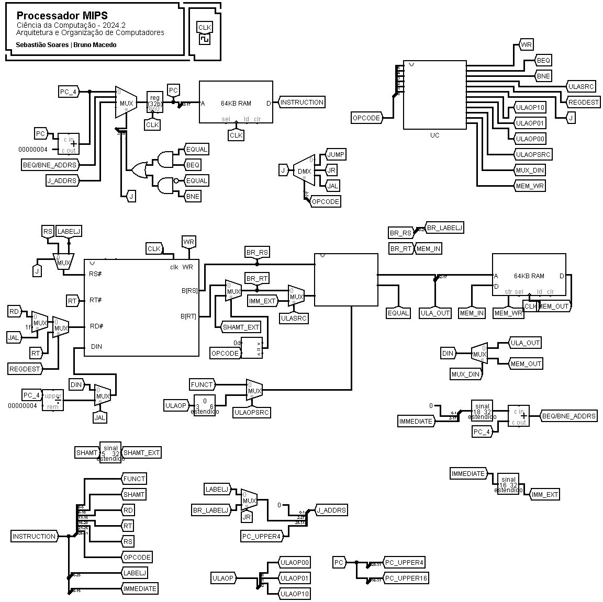

# SimMIPS

SimMIPS é um microprocessador programável desenvolvido no **Logisim**, baseado em uma arquitetura inspirada no **MIPS**. O projeto tem como objetivo explorar conceitos de arquitetura de computadores, instruções RISC e implementação de processadores no ambiente de simulação do Logisim.

## Sumário

- [SimMIPS](#simmips)
  - [Sumário](#sumário)
  - [Equipe](#equipe)
  - [Instruções implementadas](#instruções-implementadas)
    - [Tipo R (OPCODE: `000000`)](#tipo-r-opcode-000000)
    - [Tipo I](#tipo-i)
    - [Tipo J](#tipo-j)
    - [Formato das instruções](#formato-das-instruções)
    - [Exemplo de instrução](#exemplo-de-instrução)
  - [Como usar](#como-usar)
  - [O circuito](#o-circuito)
    - [Novas instruções](#novas-instruções)
      - [**AND e OR**](#and-e-or)
      - [**BNE**](#bne)
      - [**SLTI**](#slti)
      - [**SLT**](#slt)
      - [**JR e JAL**](#jr-e-jal)
      - [**SLL e SLR**](#sll-e-slr)
    - [Componentes](#componentes)

## Equipe

O projeto foi desenvolvido na disciplina de Arquitetura e Organização de Computadores do curso de Ciência da Computação da Universidade Federal do Cariri (UFCA). A equipe é composta por:

**Estudantes:**

- Sebastião Sousa Soares
- Bruno da Silva Macedo

**Professor:**

- Ramon Nepomuceno

## Instruções implementadas

Atualmente, o SimMIPS suporta as seguintes instruções:

### Tipo R (OPCODE: `000000`)

- `add` (FUNCT: `000000`)
- `sub` (FUNCT: `000001`)
- `mul` (FUNCT: `000010`)
- `div` (FUNCT: `000011`)
- `and` (FUNCT: `000100`)
- `or` (FUNCT: `000101`)
- `slt` (FUNCT: `000110`)
- `sll` (OPCODE: `001101` | FUNCT: `001000`)
- `slr` (OPCODE: `001101` | FUNCT: `001001`)

### Tipo I

- `addi` (OPCODE: `000001`)
- `subi` (OPCODE: `000010`)
- `muli` (OPCODE: `000011`)
- `divi` (OPCODE: `000100`)
- `beq` (OPCODE: `000101`)
- `bne` (OPCODE: `001001`)
- `lw` (OPCODE: `000111`)
- `sw` (OPCODE: `001000`)
- `slti` (OPCODE: `001010`)

### Tipo J

- `jump` (OPCODE: `000110`) | `PC = label`
- `jr` (OPCODE: `001011`) | `PC = BR[label]`
- `jal` (OPCODE: `001100`) | `BR[31] = PC+4; PC = label`

### Formato das instruções

```
Tipo R: OPCODE (6 bits) | RS (5 bits) | RT (5 bits) | RD (5 bits) | SHAMT (5 bits) | FUNCT (6 bits)
Tipo I: OPCODE (6 bits) | RS (5 bits) | RT (5 bits) | IMEDIATO (16 bits)
Tipo J: OPCODE (6 bits) | LABEL (26 bits)
```

### Exemplo de instrução

```assembly
addi $t1, $t0, 5
```

**Significado e código de máquina:**

```
$t1 = $t0 + 5   # 000001 00001 00000 0000000000000101 (bin) | 04200005 (hex)
```

## Como usar

1. Abra o arquivo `.circ` no **Logisim**.
2. Carregue um programa na memória RAM (como o exemplo "instruction.txt").
3. Execute o processador e observe os resultados nos registradores e na memória.

## O circuito

### Novas instruções

Nesta seção, explicamos as principais instruções adicionadas na última atualização do SimMIPS:

#### **AND e OR**
As instruções AND e OR são do tipo R e operam diretamente na ULA. Quando a UC identifica o opcode 000000, ela verifica o campo FUNCT para determinar a operação lógica a ser executada. Ambas recebem RS e RT como operandos, e o resultado é armazenado em RD. O circuito da ULA foi expandido com um terceiro bit de controle para suportar essas operações adicionais. O MUX interno à ULA, responsável pela seleção da operação, foi ajustado para acomodar esse novo bit, permitindo a execução correta das operações lógicas.

#### **BNE**
A instrução BNE (Branch Not Equal) é do tipo I e realiza um desvio condicional baseado na desigualdade entre os valores de RS e RT. Quando a UC detecta o opcode 001001, o comparador de magnitude da ULA é ativado para verificar se os valores são diferentes. Se forem, a UC gera um sinal de controle que permite atualizar o PC com o endereço de destino, calculado a partir do deslocamento imediato. A implementação reutiliza o circuito do BEQ, adicionando apenas uma inversão lógica na saída do comparador. O sinal de controle da atualização do PC, antes denominado BEQ_ADDRS, foi renomeado para BEQ/BNE_ADDRS para refletir essa mudança.

#### **SLTI**
A instrução SLTI (Set Less Than Immediate) é do tipo I e compara o valor armazenado em RS com um imediato de 16 bits. Caso RS seja menor que o imediato, o registrador RT recebe o valor 1; caso contrário, recebe 0. Para viabilizar essa operação, a UC foi ajustada para gerar um sinal de controle adicional de três bits para a ULA, compatível com a nova configuração do seletor de operações, permitindo a distinção dessa comparação específica.

#### **SLT**
A instrução SLT (Set Less Than) é do tipo R e opera de forma semelhante à SLTI, mas comparando os valores armazenados em RS e RT em vez de um imediato. O comparador de magnitude da ULA realiza a operação, e o resultado (1 ou 0) é armazenado em RD. A funcionalidade foi incorporada à ULA como parte da ampliação do MUX de seleção de operações.

#### **JR e JAL**
O circuito de salto foi aprimorado para lidar com instruções do tipo J, distinguindo internamente entre JUMP, JR e JAL. A diferenciação entre essas instruções é utilizada para definir comportamentos específicos, como:

No banco de registradores, para armazenar PC+4 em BR[31] (JAL);
Para carregar o valor de RS como destino do salto (JR);
Para definir corretamente o endereço de salto (J_ADDRS), garantindo a execução precisa de cada instrução.
O mecanismo de salto do JUMP foi reaproveitado para gerenciar os saltos de JR e JAL, minimizando a complexidade do circuito.

#### **SLL e SLR**
As instruções SLL (Shift Left Logical) e SLR (Shift Right Logical) realizam deslocamentos lógicos dentro da ULA. O controle da operação é feito pelo OPCODE, enquanto a quantidade de deslocamentos é determinada pelo campo SHAMT da instrução. Internamente, o circuito da ULA contém um MUX de seleção de operação com oito entradas: add, sub, mul, div, and, or, slt e shift. A entrada correspondente ao deslocamento foi integrada ao MUX, permitindo que a lógica de shift seja ativada conforme a necessidade. Como o código FUNCT para ambas as operações é o mesmo, a UC diferencia SLL e SLR exclusivamente pelo OPCODE, garantindo o comportamento correto da ULA.

### Componentes

**Circuito Principal (*main*)**
<br><br>
Esse é o cicuito responsável por abrigar toda a lógica e os demais componentes do SimMIPS, incluindo: BR, UC, ULA, Memória de Dados (MD) e Memória de Instruções.

**Banco de Registradores (*BR*)**
<br><br>
É onde estão contidos os 32 registradores que permitem as lógicas de manipulação de valores pelas instruções. Possui as entradas RS, RT, RD, DIN, CLK e WR, além das saídas BR[RS] e BR[RT].

**Unidade de Controle (*UC*)**
<br><br>
Componente que recebe os 6 bits do OPCODE das instruções e revela os principais comandos a serem executados, sendo eles: WR (habilita escrita no BR), BEQ, BNE, ULASRC, REGDEST (habilita RT como reg. de destino), J (indica se envolve salto do tipo J), ULAOP00, ULAOP01 e ULAOP10 (que indicam a operação da ULA, quando envolver um imediato), ULAOPSRC (indica se usará ULAOP ou FUNCT), MUX_DIN (se o reg. de destino recebe a saída da ULA ou da MD), MEM_WR (que habilita escrita na MD).

**Unidade Lógica e Aritmética (*ULA*)**
<br><br>
Componente responsável por receber BR[RS] e BR[RT], calcular conforme operação solicitada (operações básicas, operações com imediato, or, and, slt, slti e deslocamentos) e tem duas saídas: EQUAL (se os valores da entrada são iguais) e ULA_OUT (resultado). Opera com o FUNCT ou ULAOP. Possui um MUX para escolher dentre os possíveis resultados.

---

Esse README documenta a versão atual do SimMIPS e suas funcionalidades. Para colaborar, basta criar um fork.